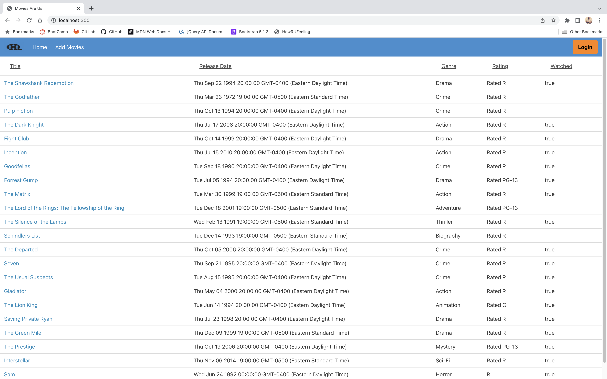
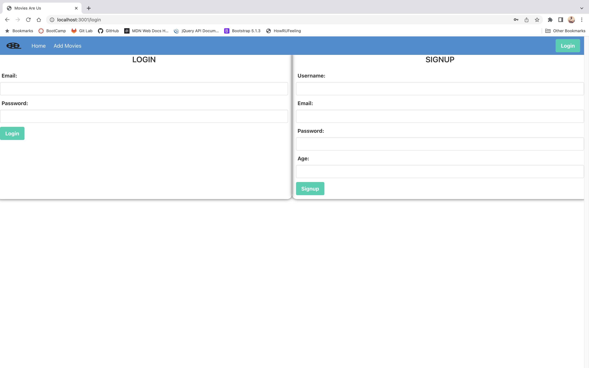
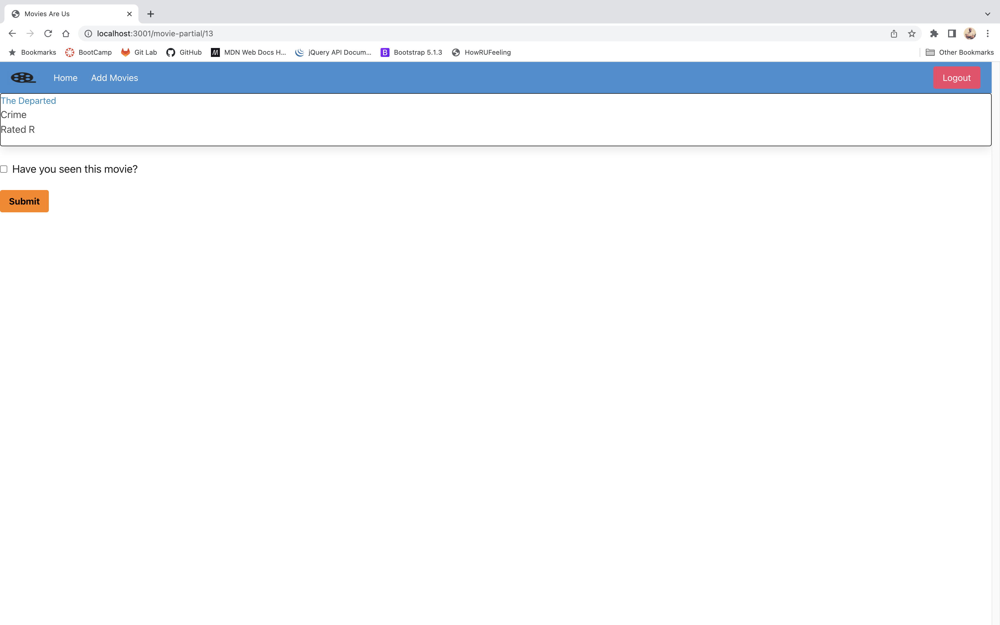
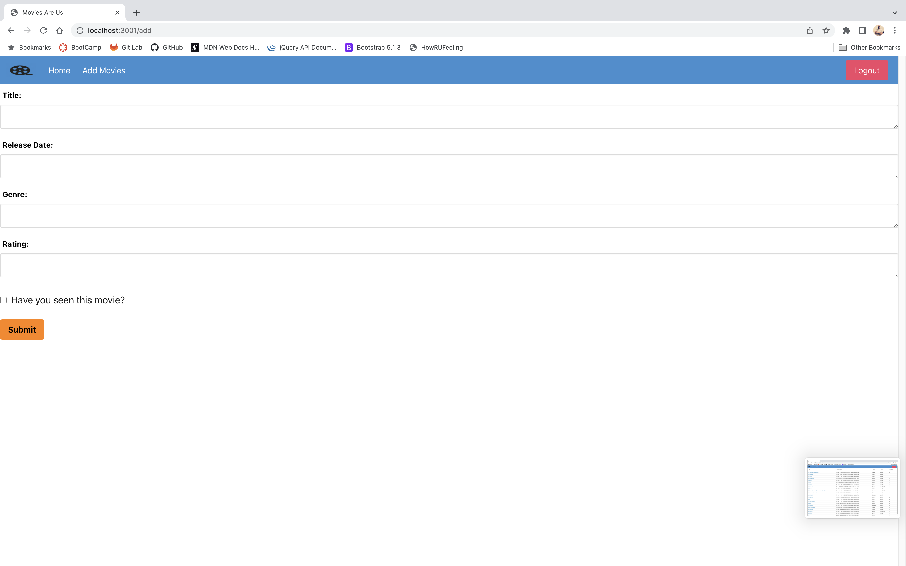

# Movies-Are-Us
## Group Project 2 

## Description: 
This is a movie database to chronicle the movies you've watched and movies you want to watch that can be edited by adding new movies to the database. 

## Motivation: 
We built this project as a way to organize your personal movie library and the movies you have and have not seen. It provides a way to keep track of the movies you'd like to see or have seen in a way that is organized and functional.  

## What we learned:
This project very much furthered our understanding of not only Handlebars, but the whole front end, back end process and how all the pieces interact with one another to form a cohesive and functioning project. This project was also a great exercise in working together as a group with people who all have different stregths and weaknesses and understandings of the different processes involved in making a functioning product. 

## Installation:
In order to install this project on your personal workspace you would first need to clone the repository to your workstation from GitHub. From there you would need to make sure you install the dependencies needed on your workstation as well. This can be accomplished by going into your terminal and entering "npm install". Once you have done this you want to make sure your database has been created and is seeded, so the server will run properly. To do this you will either want to enter the code from db/schema.sql into your MySql Workbench and run that code or in log into your MYSQL in your terminal and enter "source db/schema.sql;" and hit enter. 

From here you will want to seed your database by either entering "use movie_db;" followed by "select * from movie" and "select * from user;" in your MYSQL workbench. Or by entering "node seeds/seed.js" in your terminal. Once these steps are complete you will be able to enter run "npm start" in your terminal to start the server and then go to "https://localhost:3001" in your browser. 

## Usage: 
This is the a view of the homepage before you login. The next step is to click the orange "login" button in the top right corner. 

Next you will want to either sign up on the left side if you have not already, or sign in on the right side if you have already signed in to the site before on your local workstation. 

From there you will be redirected to the /profile page which shows your list of movies that can be interacted with by clicking on the title which is colored blue on the left side of the table. 

Clicking this will redirect you to the movie-partial page, where you can click in the checkbox whether or not you have seen that movie before.

Back on the profile page you will see a button in the nav bar that reads "Add Movies". This will redirect you to a form where you can add a movie to the movies table and choose whether or not you have seen this movie before. 

From here you will be redirected back to the movies table in the /profile page. This is your central hub where you can view your movies table, add movies, and click them individually. 

## Credits:

Sam Stikeleather
Austin Shook
Jessica Francis

Special mention:
Rich and Sasha

